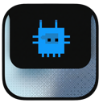

<div align="center">
  
  <h1 align="center">AgentIsland</h1>
  <p align="center">
    macOS menu bar companion for Claude, Codex, and Gemini sessions.
    <br>
    Unified approvals, session visibility, and tool timeline in one place.
  </p>
  <p align="center">
    <a href="https://github.com/javen-yan/agent-island/releases/latest" target="_blank" rel="noopener noreferrer">
      
    </a>
    <a href="#" target="_blank" rel="noopener noreferrer">
      
    </a>
  </p>
</div>

[Chinese README](./README.zh.md)

More documentation: [Docs Index](./docs/README.md)

## Introduction

AgentIsland is a macOS menu bar app for terminal-based AI agents. It pulls key session information into one place so users spend less time bouncing between terminals, editors, and approval dialogs.

It currently focuses on five areas:

- Approval requests
- Tool execution status
- Session lists
- Session history
- Runtime visibility

The current primary integrations are:

- Claude
- Codex
- Gemini

Each one follows its own official hook protocol, then maps into AgentIsland's stable internal protocol before reaching the UI.

## Current Capabilities

- Menu bar / notch entry point
- Multi-session visibility
- Tool execution timeline
- Approval flow
- Session history
- Hook install, repair, and redistribution workflow
- Internal protocol layer: `internal_event`, `permission_mode`, `extra`

## Supported Agents

| Agent | Official hook entry | Approval entry | Internal approval event | Status |
| --- | --- | --- | --- | --- |
| Claude | Claude Code hooks | `PermissionRequest` | `permission_requested` | Verified |
| Codex | Codex hooks | `PreToolUse` (`Bash`) | `permission_requested` | Verified |
| Gemini | Gemini hooks | `BeforeTool` | `permission_requested` | Integrated, needs broader validation |

## Architecture

AgentIsland uses three layers:

1. Official protocol layer
   Each agent follows its own official hook protocol.

2. Internal protocol layer
   The Rust bridge maps official events into a stable `HookPayload`.

3. UI / state layer
   Swift runtime and UI prefer internal protocol fields instead of raw official event names.

The core stable fields are:

- `internal_event`
- `permission_mode`
- `extra`

This keeps UI logic stable while allowing agent-specific differences to live inside adapters.

## Documentation

- [Docs Index](./docs/README.md)
- [Internal Hook Protocol](./docs/internal-hook-protocol.md)
- [Multi-Agent Architecture Draft](./docs/multi-agent-architecture.md)
- [Agent Extension Guide](./docs/agent-extension-guide.md)
- [Terminal Interaction Guide](./docs/terminal-interaction.md)

## Quick Start

### Requirements

- macOS 15.6+
- Claude Code CLI
- Optional: Codex CLI, Gemini CLI

### Local Build

```bash
./scripts/build.sh
```

By default this builds the app and the Rust bridge, then packages them together.

### CI Artifacts

The `main` branch and `v*` tags trigger the automated build flow:

- Compile the Rust bridge
- Build `Agent Island.app`
- Bundle `agent-island-bridge` into the app
- Package dmg / zip artifacts
- Create a release automatically for tagged builds

During repair or first install, the app prefers the bundled bridge and then redistributes it to:

```bash
~/.agent-island/hooks/agent-island-bridge
```

Skip signing locally:

```bash
AGENT_ISLAND_NO_SIGN=1 ./scripts/build.sh
```

## Debugging

View app logs:

```bash
log stream --level debug --predicate 'subsystem == "com.agentisland"'
```

View hook logs only:

```bash
log stream --level debug --predicate 'subsystem == "com.agentisland" AND category == "Hooks"'
```

Common checks:

- If Codex returns `invalid pre-tool-use JSON output`, check `hookSpecificOutput.permissionDecision` and confirm the bridge is up to date.
- If UI state does not match the CLI agent behavior, inspect `internal_event` before raw `event`.
- If a new agent integration is wired but not visible in the app, compare the bridge payload against the [Internal Hook Protocol](./docs/internal-hook-protocol.md) and the [Agent Extension Guide](./docs/agent-extension-guide.md).
- If approvals appear stuck, inspect whether `HookSocketServer` still holds leaked pending permissions.

## Security

- Permission decisions are returned through a local socket
- No cloud approval synchronization is required
- README examples do not include full session contents

Current telemetry events:

- `App Launched`
- `Session Started`

## Repository Layout

- `AgentIsland/`: macOS app
- `bridge-rs/`: Rust bridge runtime
- `docs/`: architecture and extension docs
- `scripts/`: build and release scripts

## Acknowledgements

This project evolved from [farouqaldori/claude-island](https://github.com/farouqaldori/claude-island), while extending its bridge and notification ideas into a broader multi-agent runtime.

## License

Apache 2.0
