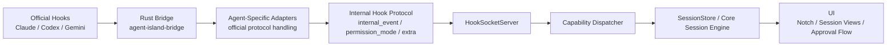

# Multi-Agent Architecture Draft

Related docs:

- [Docs Index](./README.md)
- [Internal Hook Protocol](./internal-hook-protocol.md)
- [Agent Extension Guide](./agent-extension-guide.md)

## Goal

Agent Island should treat `Claude`, `Codex`, `Gemini`, and future hook-capable agents as integrations on top of one shared runtime, not as separate product implementations.

Current implementation note:

- official hook differences are handled in agent-specific adapters
- UI and session state are moving toward the internal hook protocol documented in `docs/internal-hook-protocol.md`

The architecture goal is:

`Agent Input -> Ingress Engine -> Capability Dispatcher -> Capability Adapters -> Core Session Engine -> Output`

For internal app flow, the preferred transport is a lightweight event bus:

`Input Adapter -> AgentEventBus -> Capability Dispatcher / Core Engine -> View State -> UI`

This document defines the target shape for that flow and the contracts new agents should implement.

## Runtime Diagram

## Design Principles

- Keep the product runtime agent-agnostic wherever possible.
- Isolate protocol differences at the adapter boundary.
- Model features as capabilities, not as hard-coded agent types.
- Let unsupported capabilities be explicit instead of hidden in special cases.
- Prefer incremental migration over a rewrite.

## Runtime Layers

### 1. Agent Input

Raw data emitted by a specific agent.

Examples:

- Hook events
- Transcript files
- Runtime process metadata
- Message transport handles

Current examples in the codebase:

- `reference/bridge/agent-island-state.py`
- `bridge-rs/src/main.rs`
- `bridge-rs/src/adapter/claude.rs`
- `bridge-rs/src/adapter/codex.rs`
- `bridge-rs/src/adapter/gemini.rs`

Preferred bridge shape:

- `agent-island-bridge --source codex`
- `agent-island-bridge --source gemini`

The bridge entrypoint should stay thin and route by `source`, while agent-specific protocol differences live behind adapters.

Current direction:

- `agent-island-bridge` is the bundled runtime entrypoint
- source-specific behavior lives in per-agent Rust adapters instead of a shared shell script
- the legacy Python bridge source remains in-repo under `reference/bridge` for reference only
- the active runtime implementation lives at `bridge-rs`

### 2. Ingress Engine

Receives external input and forwards it into the app runtime.

Responsibilities:

- Manage socket lifecycle
- Decode incoming payloads
- Keep request/response channels open when required
- Preserve agent metadata such as `agentType`, `sessionId`, and `transcriptPath`

Current implementation:

- `AgentIsland/Services/Hooks/HookSocketServer.swift`

### 3. Capability Dispatcher

Routes a normalized ingress event to the correct capability pipeline.

Responsibilities:

- Decide whether an event is for permissions, transcript sync, runtime state, messaging, or notifications
- Select the correct adapter for the agent and capability
- Avoid leaking agent-specific branching into the core session engine

Target state:

- This should become an explicit layer instead of being split between socket handling, transcript providers, and state store logic.

Current scaffold:

- `AgentIsland/Services/Shared/CapabilityDispatcher.swift`

Currently routed through the dispatcher:

- hook ingress
- history load requests
- transcript file sync payloads
- runtime interrupt signals

### 4. Capability Adapters

Translate agent-specific protocols into shared internal contracts.

This is the most important normalization layer.

Adapters should be capability-specific, not only agent-specific.

Recommended adapter families:

- `HookEventAdapter`
- `PermissionCapabilityAdapter`
- `TranscriptCapabilityAdapter`
- `MessagingCapabilityAdapter`
- `RuntimeCapabilityAdapter`

Current partial implementations:

- `AgentIsland/Services/Hooks/AgentHookPlugin.swift`
- `AgentIsland/Services/Hooks/AgentPermissionAdapter.swift`
- `AgentIsland/Services/Session/SessionTranscriptProvider.swift`
- `AgentIsland/Services/Session/AgentRuntimeObserver.swift`

### 5. Core Session Engine

The shared product state machine.

Responsibilities:

- Session lifecycle
- Chat item state
- Tool execution state
- Approval state
- Waiting/processing/completed phase transitions
- Conversation metadata

This layer should not care whether the source agent is Claude or Codex.

Current implementation:

- `AgentIsland/Services/State/SessionStore.swift`

Current concrete direction:

- official hook payloads are normalized in Rust
- `HookPayload` now carries stable fields such as `internal_event`, `permission_mode`, and `extra`
- Swift runtime should prefer those stable fields over raw official event names

## Event Bus

The app should use a lightweight in-process message bus for normalized internal events.

This bus is not intended to be a heavy middleware layer. Its job is to decouple ingress from session state and keep UI consumers away from agent-specific protocols.

Recommended event split:

- `AgentIngressEvent`
  - raw normalized ingress such as hook arrival or permission socket failure
- `AgentDomainEvent`
  - internal app events such as processed session events or updated session arrays

Current scaffold:

- `AgentIsland/Services/Shared/AgentEventBus.swift`

### 6. Output

Everything user-visible or user-triggered.

Responsibilities:

- Notch state
- Chat history rendering
- Approval actions
- Sending user messages
- Session archive/remove

Current implementations:

- `AgentIsland/UI/Views/ChatView.swift`
- `AgentIsland/UI/Views/NotchView.swift`
- `AgentIsland/Services/Session/ClaudeSessionMonitor.swift`

## Capability Model

Agents should declare what they support through capabilities, not through product-layer `if agent == ...` checks.

Minimum capability set:

- `permissions`
- `transcriptHistory`
- `runtimeObservation`
- `messaging`
- `thinking`
- `toolTimeline`

Each capability should answer:

- Is the capability supported?
- What adapter implements it?
- What is the source format?
- What are the known limitations?

For the concrete integration checklist, continue with the [Agent Extension Guide](./agent-extension-guide.md).

## Standard Internal Contracts

### Permission Capability

Purpose:

- Normalize any agent permission prompt into one shared approval flow.

Shared internal contract:

- `PermissionRequestPayload`
  - `sessionId`
  - `agentType`
  - `toolUseId`
  - `toolName`
  - `toolInput`
  - `requestSource`

- `PermissionDecision`
  - `allow`
  - `deny`
  - `fallback`

Adapter responsibilities:

- Detect whether an ingress event is a permission request
- Resolve `toolUseId`
- Translate `allow/deny` into the agent-specific hook response format

Current state:

- Claude uses native `PermissionRequest`
- Codex/Gemini use bridge-driven `PreToolUse` approval
- Shared state/UI path already exists

### Transcript Capability

Purpose:

- Load conversation title, messages, tool results, and completion hints.

Shared internal contract:

- `SessionHistorySnapshot`
- `SessionIncrementalSync`

Recommended fields:

- `messages`
- `completedToolIds`
- `toolResults`
- `structuredResults`
- `conversationInfo`
- `phaseHint`

Adapter responsibilities:

- Resolve transcript location
- Parse text messages
- Parse tool calls/results
- Parse thinking/reasoning if available
- Emit phase hints such as `processing` or `waitingForInput`

### Messaging Capability

Purpose:

- Send a user-authored message back into the agent session.

Shared internal contract:

- `sendMessage(_ text: String, to session: SessionState) async -> Bool`

Adapter responsibilities:

- Resolve tmux, tty, stdin, or other transport
- Report whether messaging is supported
- Keep failure states explicit

### Runtime Capability

Purpose:

- Observe session execution state outside transcript parsing.

Examples:

- Interrupt detection
- Active tool execution
- Waiting state

Shared internal contract:

- Runtime event stream or callback interface that emits normalized session signals

### Thinking Capability

Purpose:

- Normalize agent reasoning or thinking output into shared UI blocks.

Shared internal contract:

- `ThinkingBlock`
  - `text`
  - `visibility`
  - `sourceType`

Adapter responsibilities:

- Parse readable summaries or content
- Avoid depending on encrypted or unavailable fields
- Respect agent limitations

## Agent Integration Standard

To add a new agent, the preferred path should be:

1. Define the `AgentPlatform`
2. Register a hook plugin
3. Declare capability support
4. Implement only the required capability adapters
5. Provide install/uninstall checks
6. Keep unsupported capabilities explicit

The desired outcome is that a new agent should not require modifying the core session engine.

## Current Mapping

### Claude

- Hooks: native Python bridge
- Permissions: native request model
- Transcript: full support
- Messaging: supported
- Runtime: supported
- Thinking: supported

### Codex

- Hooks: Rust bridge
- Permissions: bridge-driven approval model
- Transcript: supported
- Messaging: supported when session transport is resolvable
- Runtime: partial
- Thinking: partial, depends on readable reasoning summary/content

### Gemini

- Hooks: Rust bridge
- Permissions: bridge-driven approval model
- Transcript: not yet supported
- Messaging: not yet supported
- Runtime: partial
- Thinking: not yet supported

## Migration Plan

### Phase 1: Formalize Contracts

- Keep existing behavior intact
- Add explicit capability contracts and dispatcher interfaces
- Move comments and terminology to the new model

### Phase 2: Migrate Permissions

- Complete the permission capability abstraction
- Keep Claude-specific request correlation inside permission adapters only
- Remove protocol-specific assumptions from ingress and session code

### Phase 3: Migrate Transcript and Runtime

- Move remaining Claude-specific transcript/runtime assumptions behind adapters
- Let phase hints and conversation metadata flow through shared contracts

### Phase 4: Migrate Messaging

- Standardize send-message transport behind a capability adapter
- Keep tmux/tty specifics out of UI-facing code

## Non-Goals

- Forcing every agent to expose identical features
- Hiding capability gaps behind fake parity
- Rewriting the entire app in one pass

## Expected Benefits

- Lower cost to add new agents
- Less regression risk when extending one integration
- Cleaner product/runtime separation
- Explicit visibility into unsupported features
- Better long-term maintainability

## Practical Rule

If adding a new agent requires changes to:

- session phase logic
- chat UI logic
- approval UI logic
- global session store semantics

then the integration is probably bypassing the intended adapter boundary and should be reworked.
