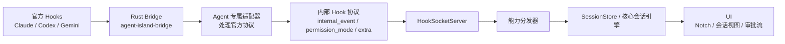

# 多 Agent 架构草案

相关文档：

- [文档索引](./README.zh.md)
- [内部 Hook 协议](./internal-hook-protocol.zh.md)
- [Agent 扩展指南（中文）](./agent-extension-guide.zh.md)

## 目标

AgentIsland 应该把 `Claude`、`Codex`、`Gemini` 以及未来新增的 hook-capable agent 视为同一套共享运行时上的集成，而不是彼此独立的产品实现。

当前实现方向：

- 官方 Hook 差异由各自的 agent 适配器处理
- UI 和会话状态逐步收敛到 `docs/internal-hook-protocol.zh.md` 定义的内部 Hook 协议

整体目标链路是：

`Agent 输入 -> 接入引擎 -> 能力分发器 -> 能力适配器 -> 核心会话引擎 -> 输出`

对应用内部流转来说，更推荐轻量事件总线：

`输入适配器 -> AgentEventBus -> 能力分发器 / 核心引擎 -> 视图状态 -> UI`

## 运行时图示

## 设计原则

- 尽量让产品运行时保持 agent 无关
- 把协议差异隔离在适配器边界
- 用能力表达差异，而不是在产品层写死 agent 类型
- 显式表达不支持的能力，而不是藏在特殊分支里
- 优先渐进迁移，而不是一次性重写

## 运行时分层

### 1. Agent 输入

由具体 agent 发出的原始数据。

例如：

- Hook 事件
- Transcript 文件
- 运行时进程元数据
- 消息传输句柄

代码中的现有例子：

- `reference/bridge/agent-island-state.py`
- `bridge-rs/src/main.rs`
- `bridge-rs/src/adapter/claude.rs`
- `bridge-rs/src/adapter/codex.rs`
- `bridge-rs/src/adapter/gemini.rs`

推荐的 bridge 形态：

- `agent-island-bridge --source codex`
- `agent-island-bridge --source gemini`

bridge 入口应尽量保持轻量，只根据 `source` 分发，具体官方协议差异都放到适配器里。

当前方向：

- `agent-island-bridge` 是打包后的统一运行时入口
- source 专属行为已经落到各 agent 的 Rust 适配器中，而不是共享 shell 脚本
- 旧的 Python bridge 保留在 `reference/bridge` 中，仅供参考
- 当前生效的运行时实现位于 `bridge-rs`

### 2. 接入引擎

接收外部输入，并转发到应用运行时。

职责：

- 管理 socket 生命周期
- 解码输入载荷
- 在需要时保持请求/响应通道不断开
- 保留 `agentType`、`sessionId`、`transcriptPath` 等 agent 元数据

当前实现：

- `AgentIsland/Services/Hooks/HookSocketServer.swift`

### 3. 能力分发器

把规范化后的接入事件路由到正确的能力处理链路。

职责：

- 判断事件属于审批、历史同步、运行时状态、消息还是通知
- 为 agent 和能力选择对应适配器
- 避免把 agent 特有分支泄漏进核心会话引擎

目标状态：

- 它应成为一个显式层，而不是散落在 socket、transcript provider 和状态仓库逻辑里

当前脚手架：

- `AgentIsland/Services/Shared/CapabilityDispatcher.swift`

当前由分发器处理的内容：

- Hook 接入
- 历史加载请求
- transcript 文件同步载荷
- 运行时中断信号

### 4. 能力适配器

把 agent 专属协议转换成共享内部契约。

这是最关键的规范化层。

适配器应尽量按能力划分，而不只是按 agent 划分。

建议的适配器家族：

- `HookEventAdapter`
- `PermissionCapabilityAdapter`
- `TranscriptCapabilityAdapter`
- `MessagingCapabilityAdapter`
- `RuntimeCapabilityAdapter`

当前的部分实现：

- `AgentIsland/Services/Hooks/AgentHookPlugin.swift`
- `AgentIsland/Services/Hooks/AgentPermissionAdapter.swift`
- `AgentIsland/Services/Session/SessionTranscriptProvider.swift`
- `AgentIsland/Services/Session/AgentRuntimeObserver.swift`

### 5. 核心会话引擎

共享的产品状态机。

职责：

- 会话生命周期
- 消息项状态
- 工具执行状态
- 审批状态
- 等待、处理中、完成等阶段转换
- 会话元数据

这一层不应该关心来源是 Claude 还是 Codex。

当前实现：

- `AgentIsland/Services/State/SessionStore.swift`

当前的具体方向：

- 官方 Hook 载荷已在 Rust 侧完成规范化
- `HookPayload` 现在带有 `internal_event`、`permission_mode`、`extra` 等稳定字段
- Swift runtime 应优先消费这些稳定字段，而不是原始官方事件名

## 事件总线

应用内部应使用一条轻量的进程内消息总线来承载规范化后的内部事件。

这条总线不应该变成沉重的中间件层。它的作用是把接入层和会话状态解耦，让 UI 使用者不必理解 agent 专属协议。

建议的事件拆分：

- `AgentIngressEvent`
  - 例如 Hook 到达、权限 socket 失败这类原始规范化接入事件
- `AgentDomainEvent`
  - 例如处理后的会话事件、更新后的会话数组这类应用内部事件

当前脚手架：

- `AgentIsland/Services/Shared/AgentEventBus.swift`

### 6. 输出

所有用户可见或由用户触发的部分。

职责：

- Notch 状态
- 聊天历史渲染
- 审批动作
- 发送用户消息
- 会话归档或移除

当前实现：

- `AgentIsland/UI/Views/ChatView.swift`
- `AgentIsland/UI/Views/NotchView.swift`
- `AgentIsland/Services/Session/ClaudeSessionMonitor.swift`

## 能力模型

agent 应通过能力声明自己支持什么，而不是在产品层通过 `if agent == ...` 判断。

最低能力集合：

- `permissions`
- `transcriptHistory`
- `runtimeObservation`
- `messaging`
- `thinking`
- `toolTimeline`

每项能力都应该回答：

- 是否支持
- 由哪个适配器实现
- 源格式是什么
- 已知限制有哪些

具体接入清单请继续参考 [Agent 扩展指南（中文）](./agent-extension-guide.zh.md)。
